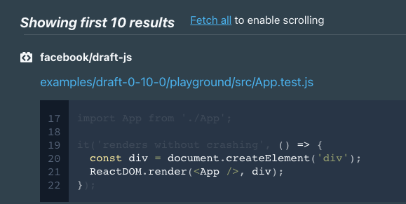
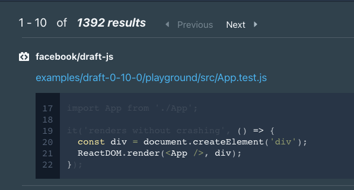
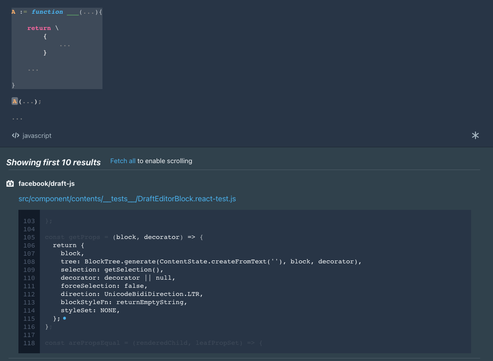

# Install

Sourcescape is only supported on Mac OS for now. Linux and Windows support coming soon.

### Prereqs

<a href="https://docs.docker.com/docker-for-mac/install/" target="_blank">Install Docker</a>

```bash
brew install watchman

npm install -g @sourcescape/cli
```

### Launching

```bash
sourcescape up <project_folder_1> <project_folder_2>
```

You must point the CLI to the directories you want to mount. The indexer will search the directories recursively for Git repos so you can simply hand it a project directory. For example, if you have a projects directory at `~/Projects` with repos `~/Projects/repo1` and `~/Projects/repo2`, you can just tell SourceScape to mount `~/Projects`.

However, it's advised to not go too many levels up as the recursive search can get expensive.

# Onboarding

First, select the repos you want to watch and index.


Wait for the initial index to finish.


# Querying


## Components

**Query Prompt** - This is where you enter your queries. Learn more [here](#queries).

**Language Selector** - Allows you to select the language you want to query in. Right now, only Javascript is fully fleshed out.

**Targeting Indicator** - Shows you what repo you're searching in. Learn more [here](#targeting). Use the [command bar](#command-bar) (cmd+shift+p) to select targeting. 

**Indexing Indicator** - When SourceScape is indexing or re-indexing a repo, you'll see a loading indicator here. You can click it to get an indexing panel showing progress.

**Saved Query Indicator** - You can save queries with cmd+s. If the query you're using is a [saved query](#saving), there will be an indicator with the name of the query.

**Cache indicator** - This indicates whether or not you're using the cache, which enables [scrolling](#scrolling) through the [result](#results) set.

**Menu** - A menu ^_^

## Queries

The idea behind SourceScape is that you can just type code and find things to search for. For simple queries, it should feel completely intuitive, without the need for a bunch of extra syntax beyond your understanding of the language itself.

Anywhere you see `___` / `...` - you can add to the query.

This is context dependent of course.

If you type here, you get an argument:


If you type here, you get an item in the function body:


SourceScape will show you the possibilities of what you can insert into that segment of the query.

You can Reset the query console from the menu.

### Behind the scenes

For more advanced queries, it's helpful to have an understanding of what's going on behind the scenes.

As you're modifying queries in the visual interface, you're actually manipulating an underlying query language called SrcLog. You can see the raw SrcLog for a query by going into the menu and hitting "Debug".

SrcLog is a logic programming language, basically a very stripped down version of ProLog or DataLog.

There are variables, denoted by capital letters A-Z. You can also define constraints on both the variables and relationships behind the variables.

For example:
```prolog
javascript::function(A).
javascript::return(B).
```
says A must be a function and B must be a return.

Then you can have 
```
javascript::function_contains(A, B).
```
to denote that function A must contain return B.


A query like this:


Will break down into 
```prolog
%dialect(javascript).

javascript::function(A).

javascript::return(B).

javascript::jsx-element(C).

javascript::identifier(D)[name = "div"].

javascript::jsx-attribute(E)[name = "style"].

javascript::object(F).

javascript::object-property(G)[name = "marginLeft"].

javascript::function_contains(A, B).

javascript::return(B, C).

javascript::jsx_tag(C, D).

javascript::jsx_attribute(C, E).

javascript::jsx_attribute_value(E, F).

javascript::object_property(F, G)[name = "marginLeft"].
```

It can be helpful to take a look at the raw SrcLog for more advanced queries to get an understanding of what's going on.


### Hover menu


Hovering over an individual object in the query will show a hover menu that allows you to manipulate that variable. This is also context sensitive.


From the menu, you can delete the object, unset its name, [select](#selection) the object, get a [reference](#references) to the object, or change / unset its index.


### References

For more advanced queries, it is useful to reference a specific variable.

For example, suppose we want to find all calls of any function that returns an object with block as a key

We can easily get the function down:


To get calls of that function, you can hover over the function object and select "Reference"


This will get you a reference to the function, which you can turn into a call with `ref[A]()`.


With these references, the interface will annotate the function with `A := ` to make the query a bit clearer.


### Dependencies (experimental)

Dependencies allow your queries to reach across files.


For example, this query will search for all classes with a property `test` that is a class D with a render method. D can be in another file, SourceScape will automatically detect the imports and exports.

## Results

As you query, SourceScape will show you the first 10 results.


Both the repo link and file link allow you to open in either Github or a local editor.


### Scrolling

If you want to go through all the results, click "Fetch all". This loads the query results into a cache and allows you to scroll through the entire result set.





### Selection

The variables of a SourceScape query can span many parts of a file and even across files. What gets displayed in the results will depend on the variable you've selected.

For example, selecting the first part of this query will show the code block with the function itself.



The second part of the query will show the code block where the function is being called.


You can select a variable from its hover menu.

## Command bar

The command bar is the main point of interaction for selecting targeting and getting saved queries.

You can open the command bar with `command + shift + p`.

### Targeting

SourceScape allows you to target your query to a specific repo, repo / branch, or repo / commit.

You first need to search for and select the repo. This will watch that repo's directory for changes. Any changes to files in that directory will update your query window.


Once a repo is selected you can search for active branches within that repo. Selecting a branch will query that branch specifically instead of simply whatever is active in the directory.


You can also search for and select a specific commit.


Specifying a file filter allows you to only query specific files. This is especially useful for mono-repos.


### Saving

You can also save targeting with `shift + command + s`.


You can save queries with `command + s`.


Both will now appear in the command bar search.


### Useful commands

`Clear repo targeting`
`Clear file targeting`
`watch [new repo]`
